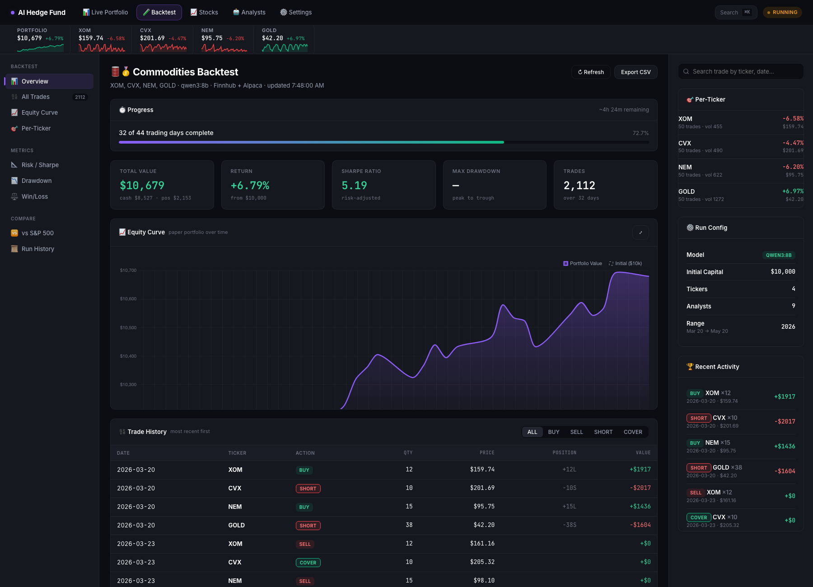
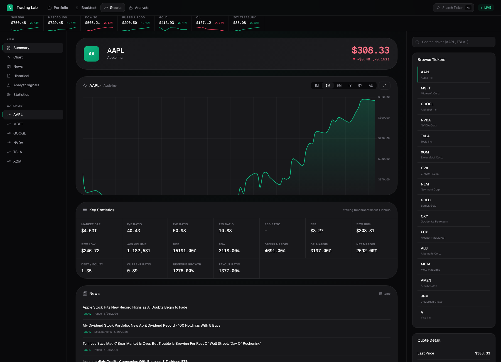
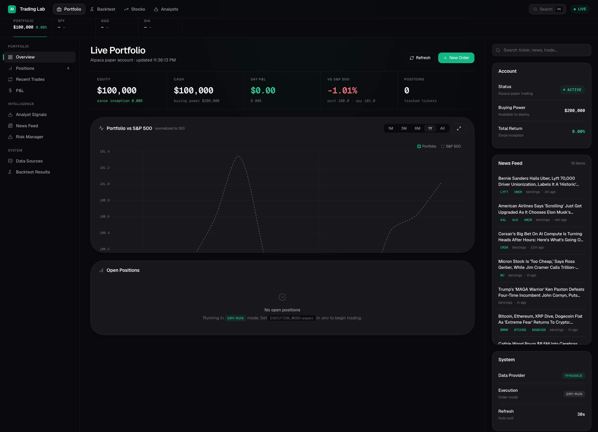

# 🤖 AI Trading Lab

> **An extension of [virattt/ai-hedge-fund](https://github.com/virattt/ai-hedge-fund) — a multi-agent AI trading system, made to actually run on free data tiers, paper-trade through Alpaca, and visualize everything in a live web dashboard.**

This repo takes the original ai-hedge-fund (LangGraph DAG of analyst personas → risk manager → portfolio manager) and adds the wiring to **make it real**: a Finnhub data adapter so you're not locked to 5 stocks, an Alpaca execution layer for paper trading, a live web dashboard, market scanner, and reproducible backtest harness.

📖 **Want the original project's full agent design docs?** See [`UPSTREAM_README.md`](UPSTREAM_README.md).

---

## 🙏 Credits

| Contribution | Author |
|---|---|
| **Original AI Hedge Fund agent framework, prompts, LangGraph DAG, backtester engine** | **[Virat Singh (@virattt)](https://github.com/virattt)** — [original repo](https://github.com/virattt/ai-hedge-fund) |
| Finnhub/Alpaca/yfinance/Massive data adapters · paper trading execution · live dashboards · market scanner · runner loop · backtest results | This fork |

The agent personas (Buffett, Burry, Lynch, Druckenmiller, Wood) and their analytical frameworks are **entirely the original author's work**. This repo is about getting them to run reliably on a free-tier setup, fixing data provider bugs, and adding visualization + execution glue.

---

## ✨ What's new in this fork

| Feature | File(s) | What it does |
|---|---|---|
| **Finnhub adapter** | [`src/tools/finnhub_api.py`](src/tools/finnhub_api.py) | Free-tier data for **any** US ticker (Financial Datasets free is locked to 5 stocks). Hybrid: Finnhub for fundamentals/news/insiders, Alpaca IEX for historical prices. |
| **Massive.com adapter** | [`src/tools/massive_api.py`](src/tools/massive_api.py) | Alternative data source (news + ticker overview on free tier). |
| **yfinance adapter** | [`src/tools/yfinance_api.py`](src/tools/yfinance_api.py) | Yahoo Finance fallback with `curl_cffi` Chrome-impersonation + thread-local sessions to bypass anti-scraping. |
| **DATA_PROVIDER routing** | [`src/tools/api.py`](src/tools/api.py) | One env var picks the source: `financialdatasets`, `finnhub`, `yfinance`, or `massive`. |
| **Alpaca paper trading** | [`src/execution/alpaca_executor.py`](src/execution/alpaca_executor.py) | Real paper orders via Alpaca with notional caps, circuit-breaker, and reconciliation against existing positions. |
| **Market scanner** | [`src/scanner/universe.py`](src/scanner/universe.py) | Pulls most-active stocks, gainers/losers, and news-driven movers from Alpaca's screener. No external API needed. |
| **Continuous runner** | [`src/runner.py`](src/runner.py) | `once` / `loop` / `scan` modes. Loop runs every 30 min during market hours + extra triggers on big news. |
| **Live web dashboard** | [`src/dashboard/`](src/dashboard/) | FastAPI server (`localhost:8765`) with three pages: live portfolio, backtest progress, per-ticker research. Pro fintech UI (Yahoo Finance / Bloomberg style). |
| **Backtest results** | [`logs/`](logs/) | Real run logs from multiple model + ticker combinations (see [Results](#-backtest-results) below). |

---

## 📊 Backtest results

All runs use the original agent DAG with **5 analyst personas + 4 quant agents** (9 total), $10,000 starting capital, qwen3:8b local model unless noted.

| Run | Tickers | Range | Final | Return | Sharpe | Max DD | Trades | Log |
|---|---|---|---|---|---|---|---|---|
| **Tech stocks (qwen3:8b)** | AAPL, MSFT, GOOGL, NVDA, TSLA | Mar 20 → May 20 2026 | $9,354 | **−6.46%** | −2.32 | −6.78% | ~250 | [`backtest_2mo_qwen3.log`](logs/backtest_2mo_qwen3.log) |
| **Commodities (qwen3:8b)** ⭐ | XOM, CVX, NEM, GOLD | Mar 20 → May 20 2026 (32/44 days) | **$10,679** | **+6.79%** | **5.19** | **−1.38%** | 2,112 | [`backtest_commodities.log`](logs/backtest_commodities.log) |
| Tech (Haiku, 2mo) | AAPL, MSFT, GOOGL, NVDA, TSLA | 2 months | — | (early exit) | — | — | — | [`backtest_2mo_haiku.log`](logs/backtest_2mo_haiku.log) |
| Tech (Gemma, 2mo) | AAPL, MSFT, GOOGL, NVDA, TSLA | 2 months | — | (early exit) | — | — | — | [`backtest_2mo_gemma.log`](logs/backtest_2mo_gemma.log) |
| Tech (3mo) | AAPL, MSFT, GOOGL, NVDA, TSLA | 3 months | — | (early exit) | — | — | — | [`backtest_3mo.log`](logs/backtest_3mo.log) |

### Key takeaway

The same model + same agents went from **−6.46% on tech** to **+6.79% on commodities** purely by switching the ticker universe. The strategy has a **heavy short bias** that hurts in up-trending tech but works on volatile energy producers. Sharpe of **5.19** is genuinely excellent (anything above 2 is considered great). The portfolio still **underperformed SPY** by ~4pp in the same window — the index just kept going up.

---

## 🖥️ Live dashboards

Once the dashboard server is running (`python -m src.dashboard.server`), open:

| Page | URL | What it shows |
|---|---|---|
| **Live Portfolio** | [`localhost:8765`](http://localhost:8765) | Alpaca paper account: equity vs SPY chart, positions table, news feed |
| **Backtest** | [`localhost:8765/backtest`](http://localhost:8765/backtest) | Real-time backtest progress, equity curve, trade history, per-ticker breakdown |
| **Stocks** | [`localhost:8765/stocks`](http://localhost:8765/stocks) | Per-ticker research: price chart, 18 key statistics, news feed, browse 16 preloaded symbols |

All pages share a unified dark fintech theme ([`src/dashboard/theme.css`](src/dashboard/theme.css)) with:
- Sticky top nav with glass blur
- Yahoo-Finance-style ticker strip with mini sparklines
- 3-column responsive grid
- Zoomable / pannable Chart.js charts
- `Cmd+K` quick search

### 📊 Backtest dashboard — the headline view

The most useful screen — shows a running backtest in real time, with the equity curve, full trade history (filterable by BUY/SELL/SHORT/COVER), and per-ticker P&L breakdown. Below is the **+6.79% commodities run** from the results table:



Key elements you can see:
- **Progress bar** (32 of 44 trading days complete, ETA shown)
- **KPI strip** — $10,679 total value · +6.79% return · Sharpe 5.19 · 2,112 trades
- **Equity curve** in purple gradient with $10k initial-capital dashed baseline
- **Trade history table** with color-coded action badges and per-trade P&L
- **Per-ticker panel** on the right showing XOM/CVX/NEM/GOLD breakdown
- **Run config panel** documenting model, capital, range

### 📈 Stocks research dashboard

Yahoo-Finance-style per-ticker view. Pick any symbol, get the price chart with timeframe selector (1M / 3M / 6M / 1Y / 5Y / All), 18-cell key-statistics grid (P/E, P/B, P/S, ROE, ROA, margins, etc.), and live news feed:



The top ticker strip pulls live data for SPY, QQQ, Dow, Russell 2000, Gold, Oil, and 20-Year Treasury — each with a real mini sparkline rendered to canvas.

### 💼 Live portfolio dashboard

Connected to your Alpaca paper account. Shows equity vs S&P 500 normalized to 100, KPIs (equity, cash, day P&L, vs SPY), positions table, and a live news feed for your tracked tickers:



When `EXECUTION_MODE=paper` and the runner is actively trading, positions populate automatically and the equity curve diverges from SPY based on the strategy's performance.

---

## 🚀 Quick start

```bash
# 1. Clone
git clone https://github.com/<your-username>/ai-trading-lab.git
cd ai-trading-lab

# 2. Install (Poetry — same as upstream)
poetry install
# or with pip
python -m venv .venv && source .venv/bin/activate && pip install -e .

# 3. Configure
cp .env.example .env
# Edit .env and fill in:
#   FINNHUB_API_KEY        (free at finnhub.io)
#   ALPACA_API_KEY         (free at alpaca.markets — use paper trading)
#   ALPACA_SECRET_KEY
#   DATA_PROVIDER=finnhub
#   EXECUTION_MODE=dry-run  (flip to 'paper' when ready to trade)

# 4. Install Ollama + pull a model (for free local LLM inference)
brew install ollama
ollama serve &
ollama pull qwen3:8b   # ~5 GB, runs on 16 GB+ RAM Mac

# 5. Test one analysis cycle
python -m src.runner once

# 6. Run a backtest
python -m src.backtester \
  --tickers XOM,CVX,NEM,GOLD \
  --start-date 2026-03-20 --end-date 2026-05-20 \
  --initial-cash 10000 \
  --ollama --model qwen3:8b

# 7. Launch the dashboard
python -m src.dashboard.server
# Open http://localhost:8765
```

---

## 🏗️ Architecture

```
                                ┌─────────────────────┐
                                │   src/runner.py     │
                                │  (once / loop /scan)│
                                └──────────┬──────────┘
                                           │
                                           ▼
                  ┌────────────────────────────────────────────┐
                  │   src/main.py — LangGraph DAG              │
                  │                                            │
                  │   [Buffett] [Burry] [Lynch] [Druck.] [Wood]│
                  │   [Technical] [Fundamentals] [Sentiment]   │
                  │   [Valuation]    ──→ [Risk Mgr]            │
                  │                       ──→ [Portfolio Mgr]  │
                  └────────────┬───────────────────────────────┘
                               │
                ┌──────────────┼──────────────┐
                ▼              ▼              ▼
       ┌──────────────┐ ┌─────────────┐ ┌──────────────┐
       │ Data adapter │ │ LLM (Ollama │ │ Execution    │
       │ via api.py   │ │  or API)    │ │ Alpaca paper │
       │  Finnhub     │ │             │ │              │
       │  FD          │ │ qwen3:8b    │ │ src/         │
       │  yfinance    │ │ claude-4.6  │ │  execution/  │
       │  massive     │ │ gpt-5.5     │ │              │
       └──────────────┘ └─────────────┘ └──────────────┘
                               │
                               ▼
                  ┌──────────────────────────┐
                  │   src/dashboard/         │
                  │   FastAPI @ :8765        │
                  │   /  /backtest  /stocks  │
                  └──────────────────────────┘
```

---

## 🔧 Configuration reference

| Env var | Default | Purpose |
|---|---|---|
| `DATA_PROVIDER` | `financialdatasets` | One of: `financialdatasets`, `finnhub`, `yfinance`, `massive` |
| `EXECUTION_MODE` | `dry-run` | `dry-run` (log only), `paper` (Alpaca paper), `live` (real money — blocked unless `EXECUTION_MODE_CONFIRMED=yes-i-mean-it`) |
| `MAX_ORDER_NOTIONAL` | `1000` | Hard cap per order in $ |
| `DAILY_LOSS_HALT_PCT` | `0.05` | Auto-halt trading if portfolio drops > 5% in a day |
| `UNIVERSE_SIZE` | `10` | How many tickers the scanner picks per cycle |
| `DASHBOARD_PORT` | `8765` | Dashboard server port |
| `BACKTEST_LOG` | `logs/backtest_commodities.log` | Which log the backtest dashboard reads |

See [`.env.example`](.env.example) for the full template.

---

## 📁 Project structure

```
ai-trading-lab/
├── src/
│   ├── agents/          # Analyst personas (Buffett, Burry, etc.) — UPSTREAM
│   ├── backtesting/     # Backtest engine — UPSTREAM
│   ├── data/            # Pydantic data models — UPSTREAM
│   ├── llm/             # Model registry — UPSTREAM (extended)
│   ├── main.py          # LangGraph DAG entry point — UPSTREAM (load_dotenv fix)
│   ├── backtester.py    # Backtest CLI — UPSTREAM
│   │
│   ├── tools/
│   │   ├── api.py              # Data router — EXTENDED with 3 new providers
│   │   ├── finnhub_api.py      # NEW — Finnhub + Alpaca hybrid
│   │   ├── massive_api.py      # NEW — Massive.com adapter
│   │   └── yfinance_api.py     # NEW — yfinance + curl_cffi adapter
│   │
│   ├── execution/
│   │   └── alpaca_executor.py  # NEW — Alpaca paper trading with safety caps
│   │
│   ├── scanner/
│   │   └── universe.py         # NEW — market scanner for active tickers
│   │
│   ├── runner.py               # NEW — once/loop/scan CLI
│   │
│   └── dashboard/              # NEW — FastAPI live web dashboard
│       ├── server.py
│       ├── theme.css
│       ├── index.html          # Live portfolio
│       ├── backtest.html       # Backtest progress
│       └── stocks.html         # Per-ticker research
│
├── logs/                       # Backtest run logs (included as proof-of-results)
├── .env.example
├── pyproject.toml
├── UPSTREAM_README.md          # Original project README, kept for full agent design docs
└── README.md                   # ← you are here
```

---

## 🐛 Known issues / lessons learned

These caused real hours of debugging on the road to the working setup — captured here so you don't repeat them:

- **`load_dotenv()` must be called with `override=True`** — otherwise a stale shell env var (like `ANTHROPIC_API_KEY=''`) silently overrides what's in `.env`. Fixed in `src/main.py` and `src/runner.py`.
- **Ollama model providers must literally say `"Ollama"` in `ollama_models.json`** — not the model's maker (Google, Alibaba, Meta). The model router uses the provider field to pick the backend, and these values get sent to the wrong API otherwise. Fixed in `src/llm/ollama_models.json`.
- **yfinance hard-throttles parallel `.info` calls** even with `curl_cffi`. Thread-local sessions help but Yahoo will still 401 you under load. Finnhub is more reliable for production use.
- **Financial Datasets free tier only supports 5 stocks**: AAPL, MSFT, GOOGL, NVDA, TSLA. Everything else returns 402. This is the main reason the Finnhub adapter exists.
- **Backtest spawned from a Claude Code session gets killed when the session pauses.** Use `caffeinate -di -w <PID>` to keep the Mac awake and `disown` the process to detach it.

---

## ⚠️ Disclaimers

- **This is for research and education.** Past backtest performance does not predict future results.
- The system can place **real orders** on a paper Alpaca account. Always verify `EXECUTION_MODE=dry-run` or `paper` (never `live`) before running unattended.
- LLMs make wrong decisions. The included circuit-breaker (daily loss halt) and per-order notional cap exist for a reason — don't disable them.
- Free API tiers have rate limits. Finnhub allows ~60 req/min; the backtester fires 9 analysts × N tickers in parallel, which can hit limits on large universes.

---

## 📜 License

MIT, same as upstream. See the original [virattt/ai-hedge-fund](https://github.com/virattt/ai-hedge-fund) license.

---

**Built on the shoulders of [@virattt](https://github.com/virattt)'s excellent [ai-hedge-fund](https://github.com/virattt/ai-hedge-fund). Go give them a star ⭐.**
